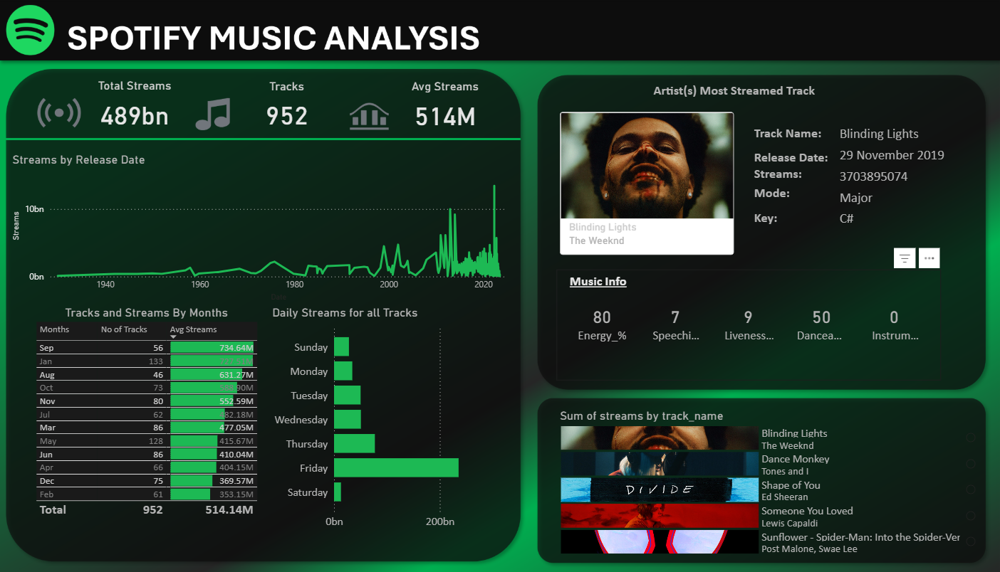

# 🎵 Spotify Music Data Analysis — Power BI Dashboard

A dynamic and interactive Power BI report built to explore and analyze streaming trends, track performance, and artist insights using Spotify's most-streamed music data.

---

## 📌 Short Description

The **Spotify Music Analysis Dashboard** is a visually rich Power BI report designed to help users explore **952 tracks** totaling **489 billion streams**. It uncovers patterns in release history, monthly streaming trends, daily listening behavior, and top-performing tracks — making it valuable for music analysts, record labels, and data enthusiasts alike.

---

## 🛠️ Tech Stack

| Tool | Purpose |
|---|---|
| 📊 **Power BI Desktop** | Core platform for report development and visualization |
| 📂 **Power Query** | Data transformation and cleaning for raw Spotify data |
| 🧠 **DAX (Data Analysis Expressions)** | Custom measures for KPIs, averages, and dynamic visuals |
| 📁 **File Formats** | `.pbix` for development, `.png` for dashboard preview |

---

## 📂 Data Source

**Source:** [Most Streamed Spotify Songs 2023 — Kaggle](https://www.kaggle.com/datasets/nelgiriyewithana/top-spotify-songs-2023)

The dataset includes:
- Track names, artist names, release dates, and stream counts
- Audio features: energy, danceability, speechiness, liveness, instrumentalness
- Musical key and mode
- Covers **952** of the most streamed Spotify tracks globally

---

## ✨ Features & Highlights

### 🔴 Business Problem

Music industry stakeholders often struggle to identify what makes a track go viral — whether it's the timing of release, audio characteristics, or day-of-week listening patterns. Raw Spotify data alone doesn't reveal these trends intuitively.

### 🎯 Goal of the Dashboard

To build an interactive visual tool that:
- Tracks overall streaming performance across 952 songs
- Identifies top-performing artists and tracks
- Reveals monthly and daily streaming behavior
- Exposes audio feature profiles of chart-topping hits

---

### 📊 Walkthrough of Key Visuals

| Visual | Description |
|---|---|
| **KPI Cards** | Total Streams (489bn), Tracks (952), Avg Streams (514M) |
| **Streams by Release Date** *(Line Chart)* | Historical trend from the 1940s to 2023, showing the streaming explosion post-2015 |
| **Tracks & Streams by Month** *(Table)* | Monthly breakdown of track count and average streams — September leads with 734.64M avg |
| **Daily Streams for All Tracks** *(Bar Chart)* | Friday dominates as the peak streaming day, aligning with new release culture |
| **Artist's Most Streamed Track** *(Card)* | Highlights top track with album art, release date, key, mode, and audio feature scores |
| **Sum of Streams by Track Name** *(Bar + Image)* | Ranks the most streamed songs with album art — led by *Blinding Lights* by The Weeknd |

---

### 💡 Business Impact & Insights

- 🎯 **Labels & A&Rs** can time releases strategically (Friday releases, September drops)
- 🎸 **Artists** can understand which audio features (energy, danceability) correlate with higher streams
- 🎧 **Playlist Curators** can identify evergreen tracks vs. trend-driven spikes
- 📈 **Analysts** can benchmark any track against the dataset's average of 514M streams

---

## 📸 Dashboard Preview



---

## 📁 Project Structure

```
├── Spotify_Dashboard.pbix   # Power BI project file
├── Dashboard.png            # Dashboard screenshot preview
└── README.md                # Project documentation
```

---

## 🚀 How to Use

1. Clone or download this repository
2. Open `Spotify_Dashboard.pbix` in **Power BI Desktop**
3. Explore the dashboard — use slicers and filters to interact with the visuals
4. Hover over charts for detailed tooltips and drill-through insights


